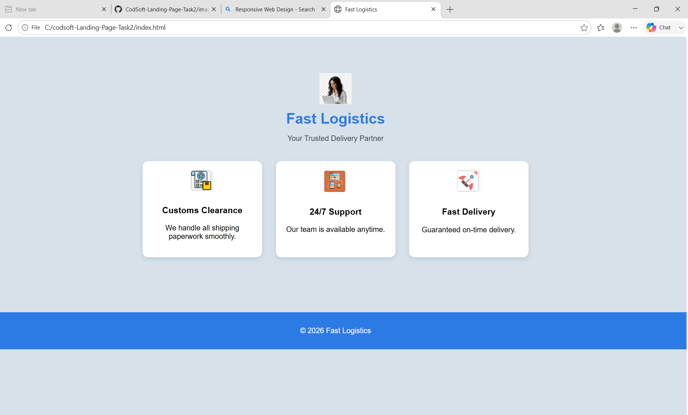

# CodSoft-Landing-Page-Task2

## 📌 Project Title

**Fast Logistics - Landing Page**

## 🌐 Landing Page Website

This project is created as part of the **CodSoft Web Development Internship (Level 1 - Task 2)**.

## 👩‍💻 Intern Details

**Name:** GOGULAPATI LAKSHMI POORNIMA

**Intern ID:** BY26RY206292

**Domain:** Web Development

**Organization:** CodSoft

## 📖 Project Description

This is a simple landing page developed using **HTML** and **CSS**.

The landing page represents a logistics company named **Fast Logistics** and includes a clean layout with essential service highlights.

### The website includes:

* Logo Section
* Company Title & Tagline
* Service Feature Cards
* Footer Section

### This project helped in understanding:

* Page Layout Design
* Section Alignment
* Card-Based Structure
* Spacing and Padding
* Color Combinations
* Footer Placement

## 🛠️ Technologies Used

* HTML
* CSS

## 📂 Project Files

* index.html
* style.css
* images/logo.png
* images/customs-clearance.png
* images/responsive-design.png
* images/speed.png

## 🎯 Objective

To create a visually appealing landing page as part of the **CodSoft Internship Level 1 Task 2**.

## 🚀 Live Link

### GitHub Pages Live Site

Add your GitHub Pages URL here:

https://poornimagogulapati-a11y.github.io/codsoft-Landing-Page-Task2

## 📸 Output

Landing page successfully created with a header section, feature cards section, and footer section.

### Landing Page Output

